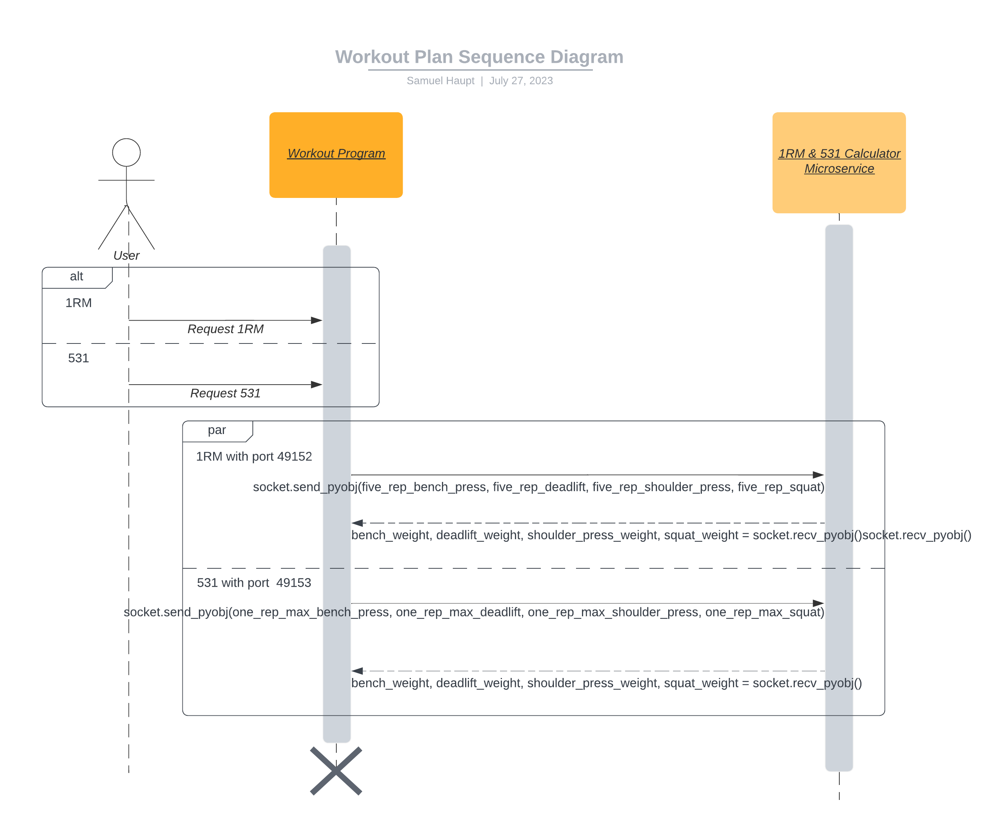

# Workout Program Communication Contract

The contract provides details for the client to programmitcally request and received data for five three one workout calculation and one repretition maximum. The microservice uses Python ZeroMQ for communication between the client and the server.

## Programmatic Request from Client to Server

1. Install [Python0MQ](https://zeromq.org/languages/python/): `pip install pyzmq`.
2. Import module: `import zmq`.
3. Create context within which to connect to a socket: `context.socket(zmq.REQ)`.
4. After setting the initialized context to a variable, such as `socket`, connect to the `localhost` interface and specified port: `socket.connect(f'tcp://localhost:{port}')`.
5. Two options for port numbers: a `port` variable needs to be established before connecting. Port `49152` is used to connect to the one repitition maximum (1RM) microservice and Port `49153` is used to connect to the five three one (531) microservice.
    + For example, `port = 49152` and `socket.connect(f'tcp://localhost:{port}')`. This will connect to 1RM microservice.
6.  Create data to be sent into the pipeline:
    + 1RM microservice with port `49152`: `five_rep_weights = (five_rep_bench_press, five_rep_deadlift, five_rep_shoulder_press, five_rep_squat)`. Ensure values are floats and greater than 0.
    + 531 microservice with port `49153`: `one_rep_maxes = (one_rep_max_bench_press, one_rep_max_deadlift, one_rep_max_shoulder_press, one_rep_max_squat)`. Ensure values are floats and greater than 0.
7.  Send data into the pipleine via [send_pyobj](https://pyzmq.readthedocs.io/en/latest/api/zmq.html#zmq.Socket.send_pyobj):
    + 1RM microservice with port `49152`: `socket.send_pyobj(five_rep_weights)`.
    + 531 microservice with port `49153`: `socket.send_pyobj(one_rep_maxes)`.

## Programmatic Receive at Client from Server

1. Ensure to follow previous steps above for installing, importing, creating context, and connecting to specified ports.
2. Receive data from the pipeline via [recv_pyobj](https://pyzmq.readthedocs.io/en/latest/api/zmq.html#zmq.Socket.recv_pyobj). This function call [blocks until data is received](https://pyzmq.readthedocs.io/en/latest/api/zmq.html#zmq.Socket.recv) from server: `socket.recv_pyobj()`
3. Establish variables to match the requested data as such:
    + 1RM microservice with port `49152`: `bench_weight, deadlift_weight, shoulder_press_weight, squat_weight = socket.recv_pyobj()`.
    + 531 microservice with port `49153`: `bench_weight, deadlift_weight, shoulder_press_weight, squat_weight = socket.recv_pyobj()`.

### Example Call and Receive for 1RM Microservice

```py
import zmq

context = zmq.Context()
socket = context.socket(zmq.REQ)
socket.connect("tcp://localhost:49152")

five_rep_bench_press = 150.0
five_rep_deadlift = 200.0
five_rep_shoulder_press = 75.0
five_rep_squat = 250.0
five_rep_weights = (five_rep_bench_press, five_rep_deadlift, five_rep_shoulder_press, five_rep_squat)

socket.send_pyobj(five_rep_weights)

bench_weight, deadlift_weight, shoulder_press_weight, squat_weight = socket.recv_pyobj()
```

### Example Call and Receive for 531 Microservice

```py
import zmq

context = zmq.Context()
socket = context.socket(zmq.REQ)
socket.connect("tcp://localhost:49153")

one_rep_max_bench_press = 200.0
one_rep_max_deadlift = 250.0
one_rep_max_shoulder_press = 100.0
one_rep_max_squat = 300.0
one_rep_maxes = (one_rep_max_bench_press, one_rep_max_deadlift, one_rep_max_shoulder_press, one_rep_max_squat)

socket.send_pyobj(one_rep_maxes)
bench_weight, deadlift_weight, shoulder_press_weight, squat_weight = socket.recv_pyobj()
```

## Workout Plan Sequence Diagram

